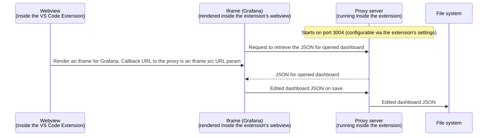

# VS Code Extension for Grafana

VS Code Extension for Grafana is an extension for VSCode that allows you to view, edit, and preview a dashboard in a running instance of Grafana without opening a browser - and without having to save the changes remotely before you are done!

This extension gives you support for Git (and any other version control system for that matter). If it is available in VS Code, it is available for you immediately.

## Features

- Reads a dashboard JSON you have locally.
- Opens the dashboard configured in the JSON in a running Grafana instance.
- Allows you to edit the dashboard from the UI.
- Saves your changes to _your_ JSON when you hit "Save" in the webview.

## Requirements

- Have a dashboard JSON handy.
- Have a running instance of Grafana locally _or_ have access to a hosted Grafana instance.
- It is best if you use an instance of Grafana that has this dashboard because otherwise some parts of it that use its UID won't load for you.
- It is best if the data sources that the dashboard references are available (and named the same) on the Grafana instance you are pointing at.

## Usage:

### Setup
- Run `yarn install` in this repo.
- Have a JSON file of a dashboard on your machine.

### Develop

1. If using local Grafana, start Grafana locally or via Docker.
2. Add `dashboardEmbed` feature toggle to Grafana config.
3. Open the extension in VS Code, then press `F5` to start the extension locally.
4. Open the Settings tab inside the extension (use `cmd` + `,` on Mac) and find the extension named `Grafana VS Code Extension`.
5. Provide the default URL for your Grafana instance in the `URL` field. If you are using a local Grafana instance, the default value is `http://localhost:3000`.
6. Create a [Service account in Grafana](https://grafana.com/docs/grafana/latest/administration/service-accounts/#create-a-service-account-in-grafana) and add a token to it.
7. Paste the Service Account token into the `Token` field of the extension's settings. Restart the extension.
8. Right-click on one of the `dashboard.json` files in the `dashboards` folder and select `Edit in Grafana`.

### Run 

1. [Package the extension](https://code.visualstudio.com/api/working-with-extensions/publishing-extension#vsce).
2. If using local Grafana, start Grafana locally or via Docker.
3. Add `dashboardEmbed` feature toggle to Grafana config.
4. Open the extension file inside VS Code, right click it and select `Install Extension VSIX` from the context menu.
5. Open the Settings tab inside the extension (use `cmd` + `,` on Mac) and find the extension named `Grafana VS Code Extension`.
6. Provide the default URL for your Grafana instance in the `URL` field. If you are using a local Grafana instance, the default value is `http://localhost:3000`.
7. Create a [Service account in Grafana](https://grafana.com/docs/grafana/latest/administration/service-accounts/#create-a-service-account-in-grafana) and add a token to it.
8. Paste the Service Account token into the `Token` field of the plugin's settings.
9. Right-click on one of the `dashboard.json` files in the `dashboards` folder and select `Edit in Grafana`. In case the extension doesn't work, restart the VS Code.


### Play
- Edit your dashboard.
- Save the changes.
- See your changes in the JSON file you used to open the editor.

The changes are not saved in Grafana. The editor is for local preview and editing only.

## Extension Settings

- `grafana-vscode.URL`: Set the URL of the Grafana instance you want to open the dashboard in. Defaults to 'http://localhost:3000'.
- `grafana-vscode.token`: A Service Account token. Defaults to an empty string.
- `grafana-vscode.message`: A toggle to show a popup message when a dashboard JSON is detected. Defaults to `true`.

## Known Issues

If you are using a hosted Grafana instance, you may need to set up the following configuration in it:
```yaml
[security]
cookie_secure = true
cookie_samesite = none
```

## Plugin communication with Grafana

