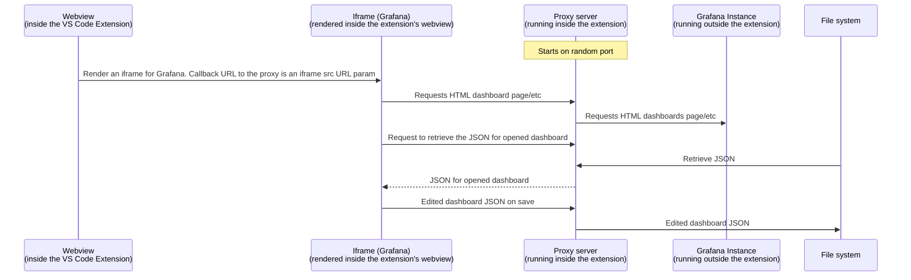

# VS Code Extension for Grafana

VS Code Extension for Grafana is an extension for VSCode that allows you to view, edit, and preview a dashboard in a running instance of Grafana without opening a browser - and without having to save the changes remotely before you are done. No more cutting/pasting JSON!

This extension gives you support for Git (and any other version control system for that matter) when editing dashboards as JSON. If it is available in VS Code, it is available for you immediately.

> **This library is experimental**
>
> The code in this repository should be considered experimental. Documentation is only
> available alongside the code. It comes without support, but we are keen to receive
> feedback on the product and suggestions on how to improve it, though we cannot commit to
> resolution of any particular issue. No SLAs are available. It is not meant to be used in
> production environments, and the risks are unknown/high.
>
> Additional information can be found in [Release life cycle for Grafana Labs](https://grafana.com/docs/release-life-cycle/).

## Features

- Reads a dashboard JSON you have locally.
- Opens the dashboard configured in the JSON in a running Grafana instance, right inside your IDE.
- Allows you to edit the dashboard from the UI.
- Saves your changes to _your_ JSON when you hit "Save" in the IDE panel.

## Requirements

- Have a dashboard JSON handy.
- Have a running instance of Grafana locally _or_ have access to a hosted Grafana instance.
- If you intend to use a dashboard across multiple Grafana instances, you will need to use datasources that have been deployed via the API, as these datasources will require consistent UIDs.

## Usage:

### Install from the Marketplace

> Coming soon.

### Run from Repository
1. If using local Grafana, start Grafana locally or via Docker.
2. Run `yarn install` in this repo.
3. Open this repo VS Code, then press `F5` to start the extension locally.
4. Open the Settings tab inside the extension (CTRL+, (comma) or `cmd` + `,` on Mac) and search for `grafana`. Then select `Extensions`.
5. Provide the default URL for your Grafana instance in the `URL` field. If you are using a local Grafana instance, the default value is `http://localhost:3000`.
6. Create a [Service account in Grafana](https://grafana.com/docs/grafana/latest/administration/service-accounts/#create-a-service-account-in-grafana) and add a token to it.
7. In the VS Code settings, click `Set your token, securely` then paste your token into the popup. Press ENTER.
8. Open a folder on your computer that has some dashboard JSON (if you don't have any of your own, navigate to the `dashboards` folder of this repo).
9. Right-click on a dashboard JSON file and select `Edit in Grafana`.
10. Have fun!
11. Note, clicking `save` on your dashboard will update the JSON file in your local folder.

### Develop
To make changes to this codebase, follow the instructions about how to run from this repository. Then, in your original VS Code window, make changes to the extension. Then, restart the extension with either CTRL+SHIFT+F5 (CMD+SHIFT+F5 on a Mac) or by clicking the green restart circle.

To view debug logs, use CTRL+SHIFT+P (CMD+SHIFT+P on Mac) then select "Developer: Open Webview Developer Tools".

## Extension Settings

- `grafana-vscode.URL`: Set the URL of the Grafana instance you want to open the dashboard in. Defaults to 'http://localhost:3000'.
- `grafana-vscode.service-account-token`: A Service Account token. This is stored in the operating system secret store. Defaults to an empty string.

## Plugin communication with Grafana

