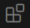

# VS Code Extension for Grafana

> [!IMPORTANT]
> VS Code Extension for Grafana has been marked for deprecation. This extension has been undermaintained for a while, to avoid further bit rot we'll be deprecating and archiving this repository in three months, until further notice. 

> [!TIP]
> The core idea of developing dashboards in a remote Grafana instance while storing them on disk locally has been integrated in `grafanactl resources serve` ([guide](https://grafana.github.io/grafanactl/guides/dashboards-as-code/)).

Grafana has an extensive UI for editing its dashboards. For many, this is sufficient for their needs. If this is you, this extension is not for you.

However, some wish to use software development tools (e.g. git) to manage their dashboards and other observability resources. Dashboards can be exported as JSON, however this JSON is hard to understand and interpret. This extension allows you to:
- Open a Grafana dashboard JSON file
- Start a live preview of that dashboard inside VS Code, connected to live data from a Grafana instance of your choice
- Edit the dashboard in the preview, using the normal Grafana dashboard editor UI
- From the editor UI, save the updated dashboard back to the original JSON file

Managing dashboards as code moves the single source of truth from Grafana itself to your version control system, which allows for dashboards to participate in gitops style workflows that are commonly used for much of the rest of software development.

## Why Work With Dashboards as Code?

- JSON dashboards can be stored in your version control system. This provides a simple solution for rollback, history, auditing, and even change control.
- If you have change-control policies for your Grafana stack, this extension allows you and other developers to test and verify dashboard changes before deploying them
- Dashboards can be generated with tools like [Grafonnet](https://grafana.github.io/grafonnet/index.html)
- Dashboards can be integrated into your IaC practices using [Terraform, Ansible, Grafana Operator, or Grizzly](https://grafana.com/blog/2022/12/06/a-complete-guide-to-managing-grafana-as-code-tools-tips-and-tricks/)

## Features

- Reads a dashboard JSON you have locally.
- Opens the dashboard configured in the JSON in a running Grafana instance, right inside your IDE.
- Allows you to edit the dashboard from the UI.
- Saves your changes to _your_ JSON when you hit "Save" in the preview.

## Requirements

- Have a dashboard JSON handy.
- Have a running instance of Grafana locally _or_ have access to a hosted Grafana instance.
- If you intend to use a dashboard across multiple Grafana instances, you will need to use datasources that have been deployed via the API, as these datasources will require consistent UIDs.

## Usage:

### Install from the Marketplace

1. Select the Extensions icon () on the left bar in VSCode.
2. Enter `Grafana` into the search box. Select the option for `Grafana / Grafana Editor` and click `Install`.
3. Open the Settings tab inside the extension (CTRL+, (comma) or `cmd` + `,` on Mac) and search for `grafana`. Then select `Extensions`.

### Configure the Extension

1. Provide the default URL for your Grafana instance in the `URL` field. If you are using a local Grafana instance, the default value is `http://localhost:3000`.
2. Create a [Service account in Grafana](https://grafana.com/docs/grafana/latest/administration/service-accounts/#create-a-service-account-in-grafana) and add a token to it.
3. In the VS Code settings, click `Set your token, securely` then paste your token into the popup. Press ENTER.

### Using the Extension

1. Open a folder on your computer that has some dashboard JSON (if you don't have any of your own, navigate to the `dashboards` folder of [this repo](https://github.com/grafana/grafana-vs-code-extension/tree/main/dashboards)).
2. Right-click on a dashboard JSON file in the file explorer and select `Edit in Grafana`.
3. Have fun!
4. Note, clicking `save` on your dashboard will update the JSON file in your local folder.

## Extension Settings

- `grafana-vscode.URL`: Set the URL of the Grafana instance you want to open the dashboard in. Defaults to 'http://localhost:3000'.
- `grafana-vscode.service-account-token`: A Service Account token. This is stored in the operating system secret store. Defaults to an empty string.

## Extension communication with Grafana
Details of how this extension communicates with Grafana is available [here](https://github.com/grafana/grafana-vs-code-extension/blob/main/how-it-works.md).

## Contributing

See our [contributing guide](CONTRIBUTING.md).

## Maturity

The code in this repository should be considered as "**public preview**" and is actively developed and maintained by Engineering teams at Grafana.

While this extension is stable enough to be used in production environments, occasional breaking changes or bugs can be expected.

> [!NOTE]
> Bugs and issues are handled solely by Engineering teams. On-call support or SLAs are not available.
